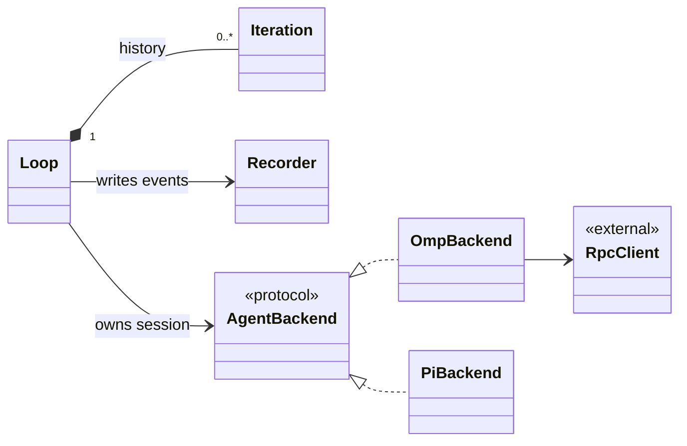

# kopt

Kopt scaffolds optimization projects and supervises repeated agent turns. Its classes
use composition rather than inheritance: a loop owns its iteration history, agent
session, and append-only recorder. The session is an `AgentBackend` (`kopt/agent.py`):
`OmpBackend` wraps `omp_rpc.RpcClient`, `PiBackend` speaks pi's RPC protocol over
stdin/stdout with the standard library. The loop needs five things from it: start,
prompt and wait for the turn to settle, state, cumulative stats, and an event stream.

